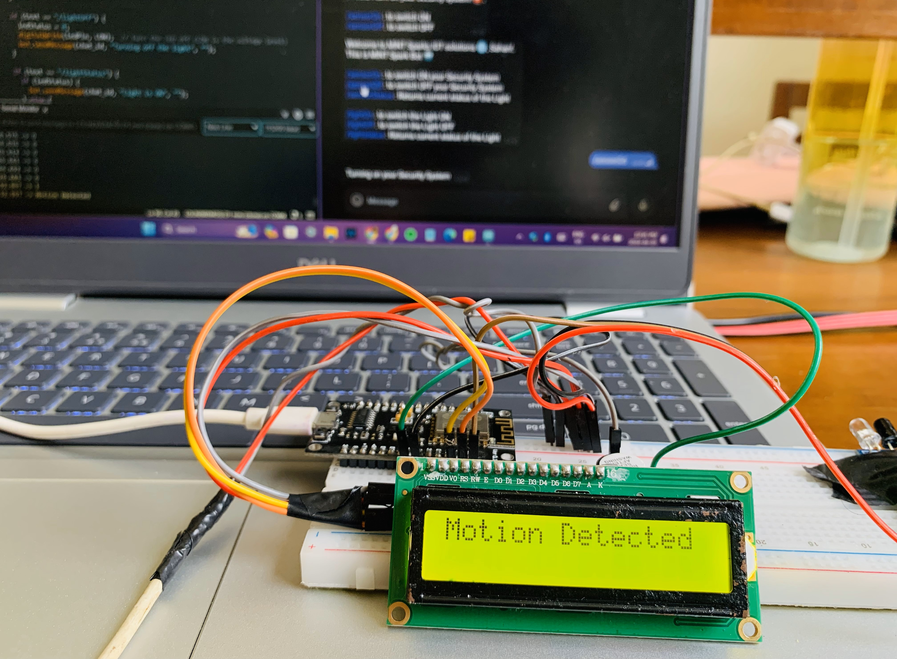
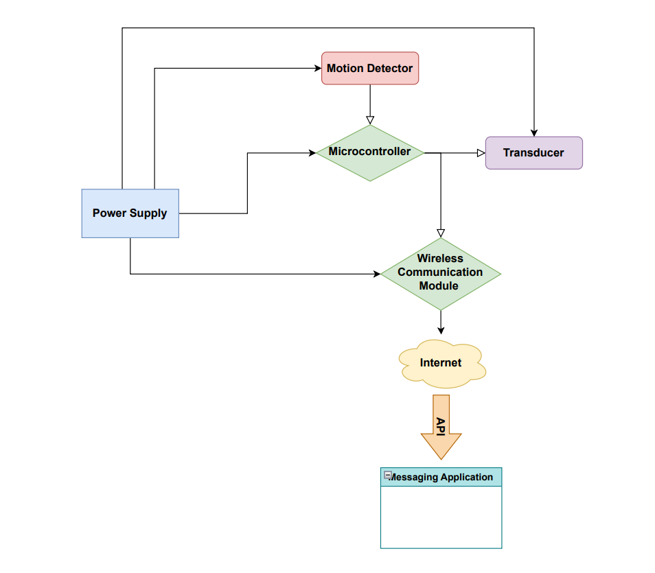

# Smart Home Security System



## Overview

The Home Security System is a smart and affordable solution designed to enhance home security through IoT technology. The system utilizes NodeMCU ESP8266, IR sensors, and Telegram app integration to provide real-time monitoring and control of the security system from anywhere with an internet connection.

## Block Diagram



## Wiring Diagram


## Features

- **Real-time Motion Detection:** The IR sensor detects motion within the environment and triggers security alerts.
- **Remote Control via Telegram:** Users can interact with the system remotely using simple commands sent via the Telegram app on their smartphones.
- **Cost-effective and Scalable:** The system utilizes affordable IoT components and is designed to accommodate future expansions and integrations with other smart home devices.

## Installation

1. Clone the repository:

```bash
git clone https://github.com/sahanrashmikaslk/SmartHomeSecuritySystem-Using_NodeMCU.git
```

2. Set up the NodeMCU ESP8266 with the required libraries (LiquidCrystal_I2C, ESP8266WiFi, UniversalTelegramBot, ArduinoJson, etc.).
3. Customize the Arduino code (SecuritySystem.ino) according to your WiFi credentials and Telegram bot token.
4. Connect the IR sensor and other components as per the circuit diagram provided.
5. Upload the Arduino code to the NodeMCU ESP8266 board using the Arduino IDE.

## Usage

1. Power on the NodeMCU ESP8266 board and ensure it is connected to your WiFi network.
2. Open the Telegram app on your smartphone and search for the configured Telegram bot.
3. Use commands such as ``` /sensorOn```, ``` /sensorOff```, ```/lightOn```, ```/lightOff```, etc., to control the security system remotely.
4. Receive real-time notifications and alerts about security events detected by the system.

## Future Developments

- Integration of additional sensors such as cameras and door/window sensors for comprehensive home monitoring.
- Implementation of machine learning algorithms for advanced threat detection and analysis.
- Expansion to a full-scale smart home security ecosystem with integrated automation features.

## Contributors

- Sahan Lelwala
- Dushmin Malisha
